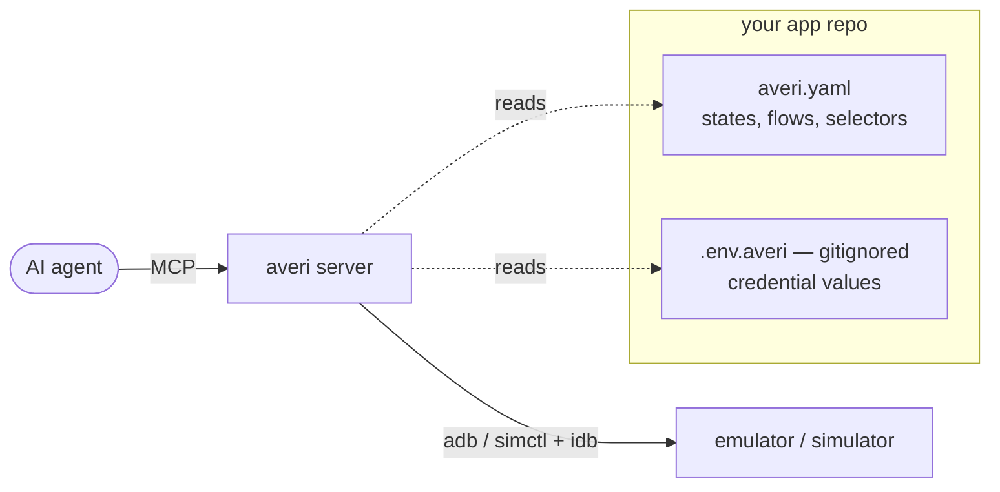
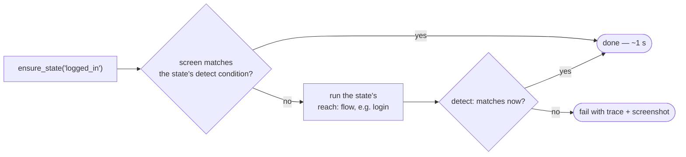

# averi — on-device verification for AI coding agents

averi is an [MCP](https://modelcontextprotocol.io) server that gives a coding agent hands on **iOS Simulators and Android Emulators**: launch the app, tap, type, read the screen, assert, screenshot. Its differentiator is `ensure_state` — the project checks in an `averi.yaml` describing app states (like *logged in*) and how to reach them, so the agent gets past login and deep into the app **deterministically**, instead of fumbling through it tap by tap on every task.

averi itself is project-independent: it ships only tools. Everything app-specific — states, flows, credentials — lives in **your app repo**.

## Installation

averi is on npm — nothing to clone or build. Setup is a job for your agent, not for you:

**1. Register the MCP server** (in your app repo):

```bash
claude mcp add averi -- npx -y averi
```

**2. Restart your agent session and paste this prompt:**

> Set up the averi tool in this repo. Fetch https://raw.githubusercontent.com/mholecy/averi/main/SETUP.md and follow it step by step — run every check, and don't report done until the final verification passes.

The agent handles the rest: verifies prerequisites (`adb`, `idb`, a booted device), creates the gitignored `.env.averi` for test credentials, installs the [agent skill](skill/SKILL.md), **authors `averi.yaml` by driving your actual app**, and proves the setup by logging in end to end — twice (once cold through the full flow, once warm in ~1 s).

Prefer to do it by hand, or setting up for a whole team (committed `.mcp.json`)? Everything is in **[SETUP.md](SETUP.md)** — it reads fine for humans too.

**Updating later** is also an agent job — ask it to follow [SETUP.md → Updating averi](SETUP.md#updating-averi) (bumps the version, re-syncs the copied skill so it can't drift, re-runs the login proof).

## What is averi



Your agent changes mobile code all day but can't see whether the app actually works. averi closes that loop: after a change, the agent builds the app, installs it, drives it to the changed screen, and verifies — on both platforms, on real simulators.

Three ideas make that reliable:

- **One tree, one selector language.** Both platforms' accessibility trees are normalized into one model, so the same selectors (`id:`, `text:"…"`, `role:`) — and usually **one yaml** — drive both OSes, with per-platform overrides only where they differ.
- **States over tap sequences.** `averi.yaml` declares *where the app can be* and *how to get there*. The agent says `ensure_state("logged_in")` and averi does the rest, deterministically.
- **Credentials never in yaml.** `${ENV_VAR}` references resolve from a gitignored `.env.averi` (real env vars win, so CI works normally), and values are redacted (`***`) from every trace and error.

## How it works

### `ensure_state` — the core loop



Idempotent — the agent calls it freely; it costs ~1 second when the app is already there.

### The yaml is code

States and flows live in your repo and evolve with your app — when navigation changes and a flow times out, the agent fixes the descriptor as part of the change. You don't hand-author it either: the agent bootstraps it by driving your app ([SETUP.md, step 4](SETUP.md#step-4--author-averiyaml-by-driving-the-app)).

```yaml
states:
  logged_in:
    detect: { element: { text: "Accounts" } }
    reach: [login]

flows:
  login:
    steps:
      - launch: { clearState: true }
      - tap: { text: "Log in" }
      - type: { value: $password }        # resolves from .env.averi — never a literal
      - wait: { state: logged_in, timeout: 20s }
```

The schema covers the real world: per-platform steps, PIN keypads without resource-ids, auto-advancing OTP boxes, `branch:` for state-dependent paths, `optional:` for dismissable interstitials.

### Verification is tiered — cheapest first, numbers over impressions

| Tier | Tool | What it answers |
|---|---|---|
| 1 | element `assert` | Is the element there, with this text/error? Deterministic, no vision. |
| 2 | `screenshot` | Does it *look* right? The agent judges with its own vision. |
| 3 | baseline pixel-diff | Did anything visually regress since last time? |
| 4 | `rect` / `color` / `ocr` asserts, layout contracts | Is the margin 24pt, the fill `#FDFDFD`, the rendered copy `CONTINUE`? Geometry and color are arithmetic — never eyeballed. |

`verify` runs the same state/flow/asserts on **both platforms** and returns paired screenshots; with a layout contract it appends per-anchor geometry, color (CIEDE2000) and text/type-size parity tables. Every response reports `appAlive`, with a crash-log excerpt if the app died. Full detail: [docs/verification.md](docs/verification.md).

### One habit that pays off immediately: stable ids

averi can only select what the accessibility tree exposes. Give new screens test identifiers — `Modifier.testTag("login_submit")` on Android Compose (with `testTagsAsResourceId = true` at the semantics root), `.accessibilityIdentifier("login_submit")` on iOS — and flows become locale-proof and asserts component-precise. Make it part of the definition of done; it also improves real accessibility tooling. (React Native on iOS needs one extra yaml line — see [SETUP.md](SETUP.md#step-4--author-averiyaml-by-driving-the-app).)

## Requirements

Node 20+. **Android**: `adb` + a running emulator (macOS/Linux/Windows). **iOS**: macOS with Xcode, a booted simulator, and `idb` — Apple ships simulators only with Xcode. Exact install commands and checks: [SETUP.md, step 0](SETUP.md#step-0--prerequisites).

On a Linux/Windows box you get the full Android toolset — pass `platforms: ["android"]` to `verify` (its default runs both platforms; iOS tools error only when called). OCR-backed checks (`ocr` asserts, text/type-size parity) use the macOS Vision framework and fall back to the accessibility tree elsewhere. Windows is untested — reports welcome.

## Documentation

| Doc | For | What's in it |
|---|---|---|
| [SETUP.md](SETUP.md) | your agent (and you) | Step-by-step setup with verification checks |
| [skill/SKILL.md](skill/SKILL.md) | the agent, every session | Golden path, rules, recipes, yaml reference |
| [docs/verification.md](docs/verification.md) | reference | Assert semantics, forms, layout/color/text contracts |
| [ARCHITECTURE.md](ARCHITECTURE.md) | contributors | Design, adapters, tool surface, roadmap |

## Development

```bash
npm install
npm test           # vitest
npm run build      # tsc → dist/
npm run dev        # run the MCP server over stdio from source
```

Layout: `src/adapters/` (adb, simctl/idb, opt-in WDA tree source, one normalized tree) · `src/flow/` (yaml schema + engine) · `src/verify/` (asserts, baselines, crash scan) · `src/mcp/` (tool layer) · `skill/` · `docs/plans/`.
